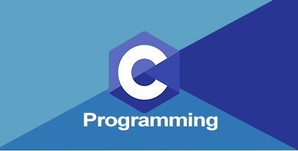

## 가나다

1. 라마바사
2. 아자차카타파하
3. 

```c
#include <stdio.h>

void cough(void);

int main(void)
{for (int i = 0; i < 3; i++)
    {cough();
    }
}

void cough(void)
{printf("cough\n");
}
```

이거 한글이 깨지는지 확인해 봅니다.
